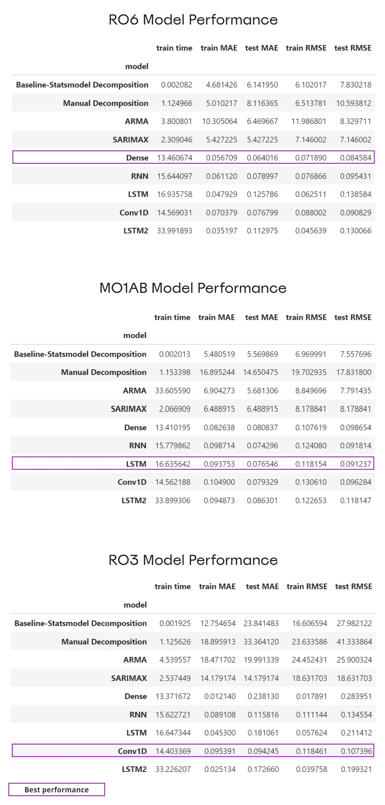

# Forecasting Pharmacy Medication Sales

**Karin Huegele**

## Executive summary
This project explores several machine learning models to find the best model to forecast pharmacy medication sales.

## Rationale
Accurate forecasting of drug sales will enable pharmacies to manage their inventory more efficiently. If pharmacies can rely on the forecast's accuracy, they can maintain smaller inventories, reduce operating costs, and reduce waste due to medication expiration.

## Research Question
In the pharmacy industry, it is essential to ensure patient safety and that the pharmacy dispenses only high-quality medications. As the pharmacy mail order utilization increases, it becomes crucial that the pharmacy can deliver medications efficiently and on time.  

However, predicting medication dispensing can be tricky. Some of the main factors that affect a prescription order are:
* Doctor's approval
* Pharmacy benefit manager's (PBM) approval
* Product availability
* Product unbreakable unit of packaging
* Risk of medication stockpiling

Due to the Protected Health Information (PHI) restrictions, patient personal health data is not publicly available. Using only the pharmacy sales data available in the public domain, how might we devise an accurate forecast of medication demand in the future?

## Data Sources
For this project, I use a dataset from [Kaggle](https://www.kaggle.com/datasets/milanzdravkovic/pharma-sales-data) consisting of weekly pharmacy sale data collected in 6 years, from 2014 to 2019, for eight drug categories.

## Methodology
For this project, I explored time series for three drug categories:
* R06 - Antihistamines for systemic use
* R03 - Drugs for obstructive airway diseases
* M01AB - Anti-inflammatory and antirheumatic products, non-steroids, Acetic acid derivatives, and related substances.

I started by using the Statsmodel seasonal decomposition library as my baseline. I also performed a manual seasonal decomposition to understand my dataset's seasonal components, trends, and residuals. From there, I explored possible performance improvement using ARMA, SARIMAX, and RNN models using Dense, Simple RNN, LSTM with one layer, and LSTM with three layers.

To aid in readability, I created a Jupyter notebook for each drug category containing my analysis. I started by examining the R06 dataset. Once completed, I utilized the notebook to perform the same analysis for R03 and M01AB.

## Results
Based on my analysis, neural network models performed the best in forecasting sales across all three medication categories.

The neural network models have the lowest root mean squared error values (RMSE) and mean absolute error (MAE). However, training neural networks requires a significant amount of time. Also, setting up the training and test data was more complex. The SARIMAX and the stats model seasonal decomposition are the easiest to use and interpret. 

## Next steps
Additional work to improve model performance:
* **Fine-tune models.**  R03 and M01AB can benefit from more analysis and model fine-tuning for better prediction performance.
* **Enable rolling window visualization for the neural network models.**  Enabling the rolling window dataset animation will improve the interpretability of the model's performance.
* **Explore other machine learning models, such as XGBoost and transformer models.**  We may explore XGBoost and transformer models to see if we can gain better performance for time series forecasting.
* **Improve the grid search mechanism for the Sarimax model.**  We can enhance the grid search mechanism for SARIMAX to make it easier to find the best Sarimax model parameters.

This project produced a valuable framework for evaluating regression models for time series forecasting. With further enhancements, we will be able to utilize this tool to perform real-world analysis and build a performant model for production deployment.

## Outline of project

- [R06 - Antihistamines for systemic use](https://github.com/kg5hqx/Capstone2/blob/master/notebooks/R06/Module-24-v3-R06.ipynb)
- [R03 - Drugs for obstructive airway diseases](https://github.com/kg5hqx/Capstone2/blob/master/notebooks/R03/Module-24-v3-R03.ipynb)
- [M01AB - Anti-inflammatory and antirheumatic products, non-steroids, Acetic acid derivatives, and related substances](https://github.com/kg5hqx/Capstone2/blob/master/notebooks/M01AB/Module-24-v3-M01AB.ipynb)

## Contact and Further Information
For more information about this project, please contact Karin Huegele, kg5hqx@hugelheim.us
